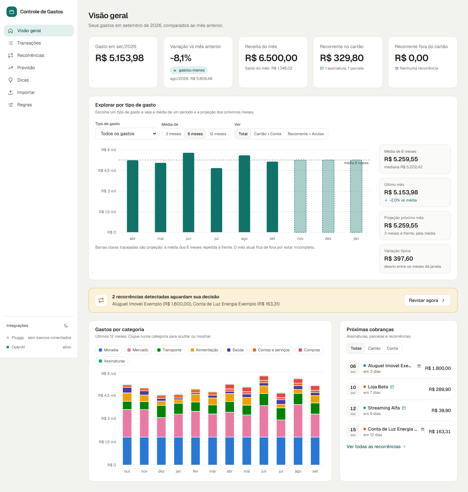
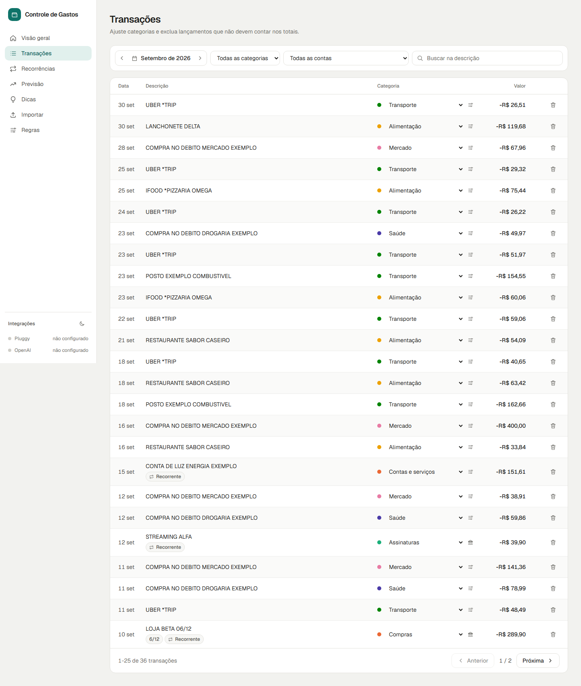
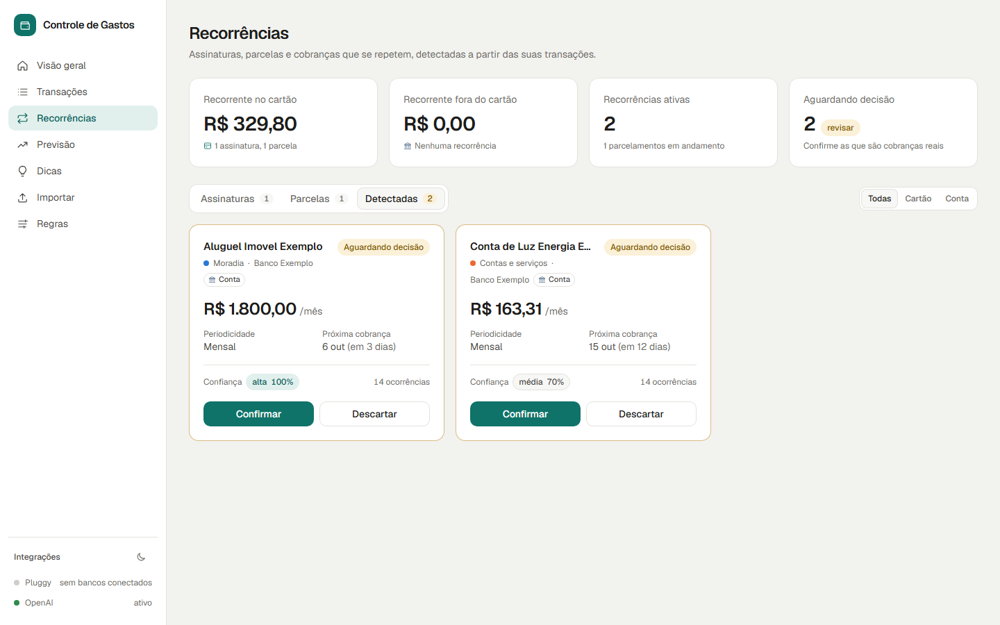
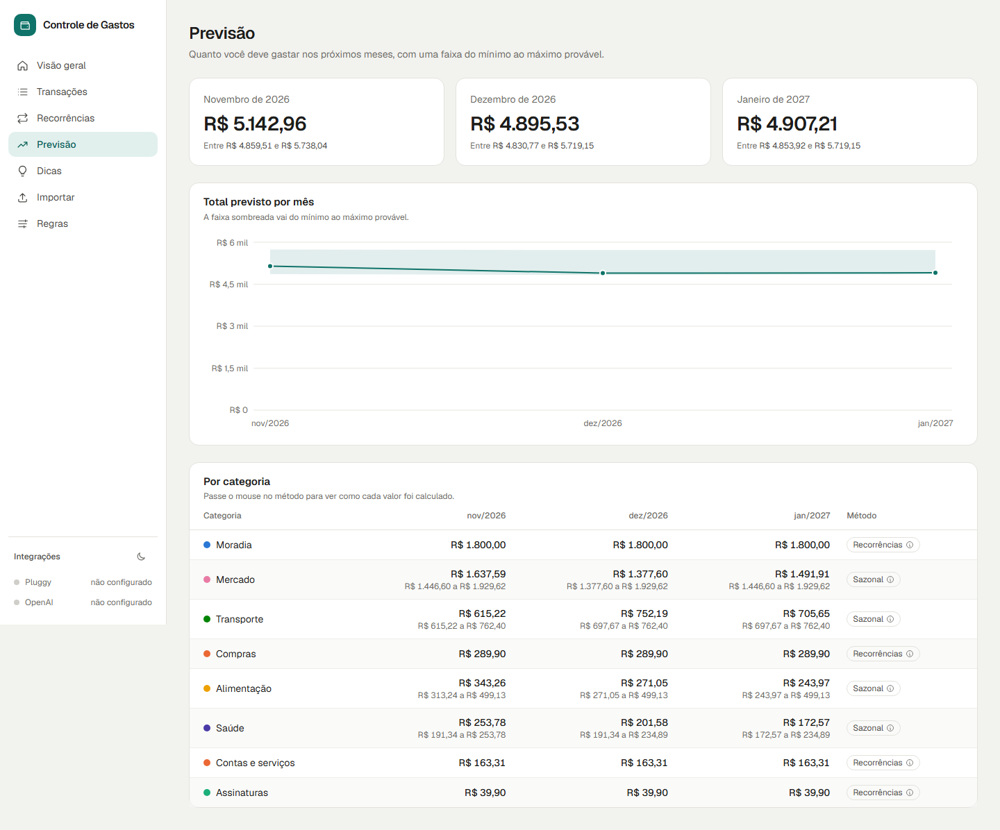
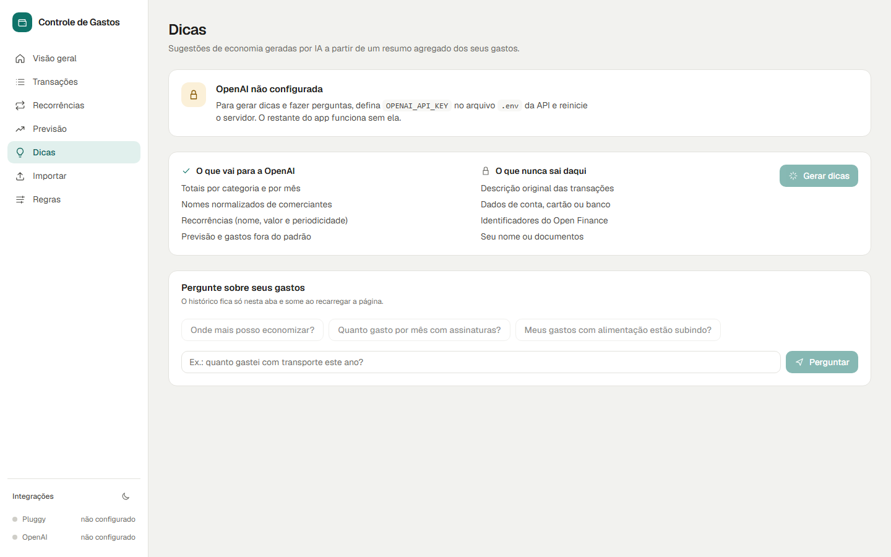
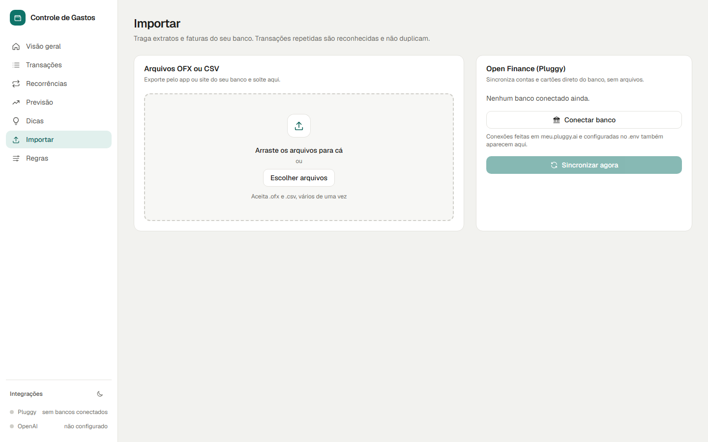
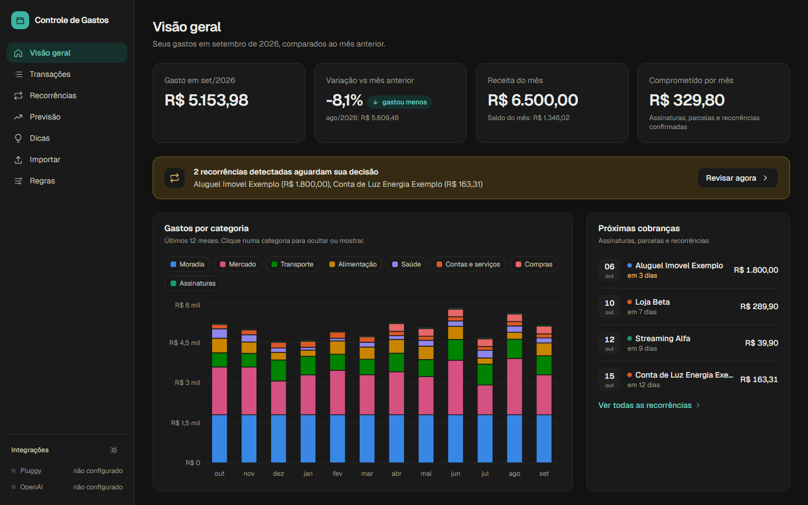

# Controle de Gastos

Controle financeiro pessoal que puxa extratos e faturas dos seus bancos (Inter, Nubank, Banco do Brasil, Itau e
outros) via Open Finance, organiza por categoria, encontra gastos recorrentes (inclusive os que o cartao nao
marca como recorrentes), projeta os proximos meses e pede dicas de economia a um LLM.

> Seus dados ficam na sua maquina. O codigo e publico; o `.env` e a pasta `data/` nunca sobem para o git.



<details>
<summary>Mais telas (dados sinteticos do modo demo)</summary>

| Transacoes | Recorrencias |
|---|---|
|  |  |

| Previsao | Dicas |
|---|---|
|  |  |

| Importar | Tema escuro |
|---|---|
|  |  |

</details>

## Como funciona

```
Meu Pluggy (Open Finance) ──┐
                            ├─> api/ (FastAPI + SQLite em data/) ──> web/ (Next.js)
OFX / CSV exportados ───────┘          │
                                       └─> resumo redigido ──> OpenAI ──> dicas
```

- **Ingestao**: `gastos sync` busca contas, transacoes e faturas pelo [Meu Pluggy](https://meu.pluggy.ai)
  (gratis para uso pessoal, ate 5 bancos, atualiza 1x por dia). `gastos import data/inbox` le OFX/CSV
  exportados do app do banco, util para historico antigo.
- **Categorias**: categoria da Pluggy, sobrescrita por regras suas (regex) e por ajustes manuais. O sync
  nunca apaga nada seu.
- **Recorrencias**: assinaturas, parcelas e recorrencias *detectadas* (Pix, boleto, debito que se repetem
  todo mes mesmo sem o banco marcar). Voce confirma ou descarta.
- **Previsao**: proximos meses = recorrencias ativas + mediana das categorias variaveis, com faixa.
- **Dicas**: so um resumo agregado e redigido vai para a OpenAI (sem ids, sem conta, sem extrato bruto).

## Rodando

1. Copie `.env.example` para `.env`.
2. Crie conta em [meu.pluggy.ai](https://meu.pluggy.ai), conecte seus bancos, depois em
   [dashboard.pluggy.ai](https://dashboard.pluggy.ai) crie a aplicacao, ative o conector **MeuPluggy**, copie
   `Client ID`, `Client Secret` e os `Item IDs` para o `.env`.
   Alternativa: so `Client ID` e `Client Secret` no `.env` e use o botao **Conectar banco** na tela Importar
   (widget Pluggy Connect). No plano gratis o widget so conecta o conector sandbox; bancos reais pelo widget
   exigem plano pago, por isso o caminho gratis e o Meu Pluggy + `Item IDs`.
3. (Opcional) `OPENAI_API_KEY` para as dicas.
4. `docker compose up` e abra http://localhost:3000. Ou, sem Docker:
   ```
   cd api && python -m venv .venv && .venv/Scripts/pip install -e ".[dev]"
   .venv/Scripts/gastos sync            # ou: .venv/Scripts/gastos demo-seed
   .venv/Scripts/uvicorn gastos.api.main:app --reload
   cd ../web && npm install && npm run dev
   ```

`gastos demo-seed` popula o banco com dados sinteticos para conhecer o app sem conectar nada.
`gastos recalcular` refaz categorias automaticas, recorrencias e previsao (o sync e o import ja fazem isso).

## Estado

- Backend: ingestao OFX/CSV e Pluggy, categorias em camadas, recorrencias, previsao e dicas, com 74 testes.
- Frontend: 7 telas (visao geral, transacoes, recorrencias, previsao, dicas, importar, regras), tema claro
  e escuro, responsivo.
- Screenshots em `docs/screenshots/`, gerados do modo demo com Playwright
  (`npx playwright screenshot --viewport-size=1440,900 http://localhost:3000/ docs/screenshots/visao-geral.png`).

## Privacidade e LGPD

- `data/` (banco SQLite, arquivos OFX/CSV) e `.env` estao no `.gitignore`.
- `pre-commit` com [gitleaks](https://github.com/gitleaks/gitleaks) e `scripts/check_no_personal_data.py`
  bloqueiam commits com CPF, credenciais ou arquivos de extrato. Instale com `scripts/install_guardrails.ps1`.
- Testes e screenshots usam apenas dados sinteticos.
- Para a OpenAI vai somente o resumo agregado produzido por `api/src/gastos/insights/redact.py`.

## Desenvolvimento

Veja [CLAUDE.md](CLAUDE.md) para convencoes, comandos e os subagentes do projeto.
Licenca MIT.
